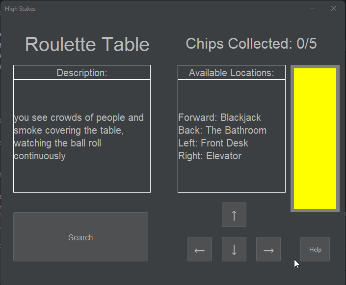
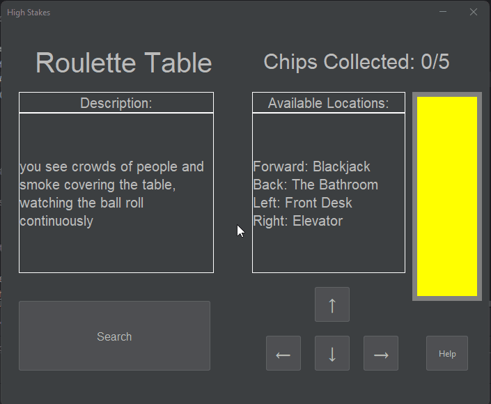
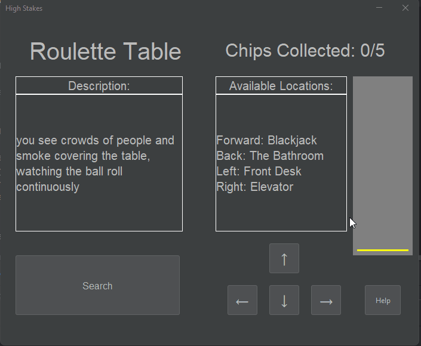
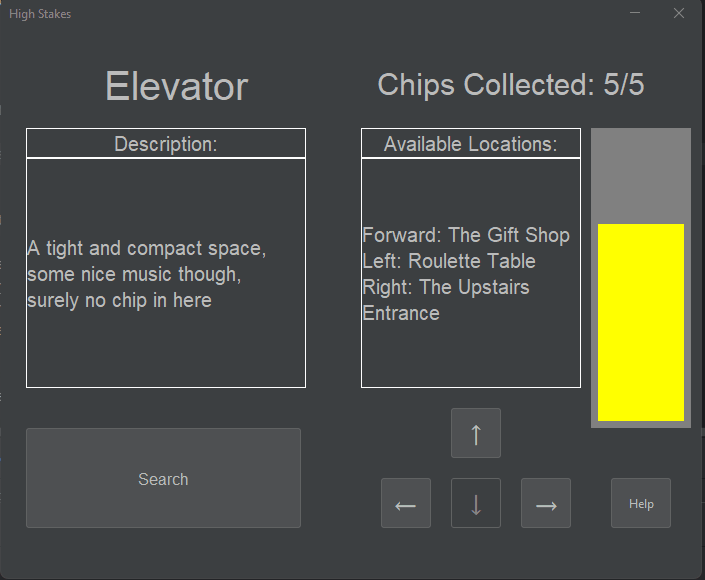
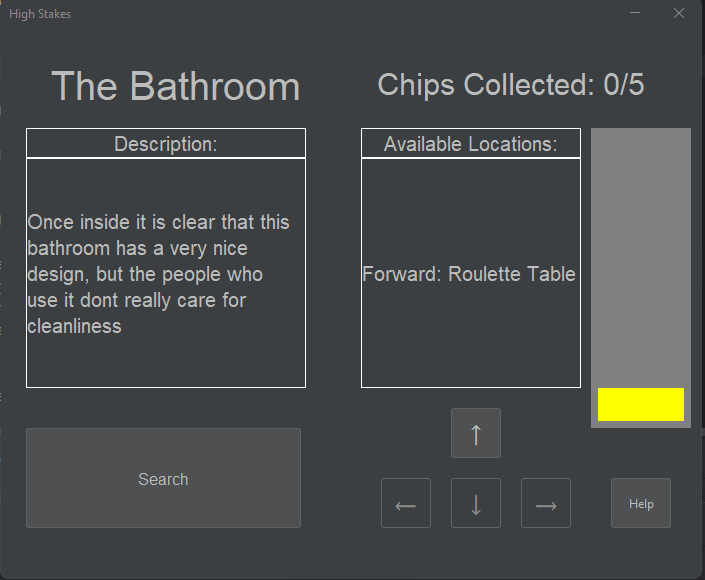
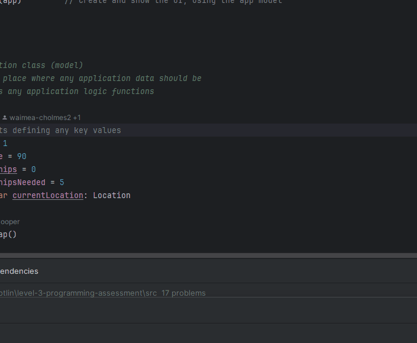
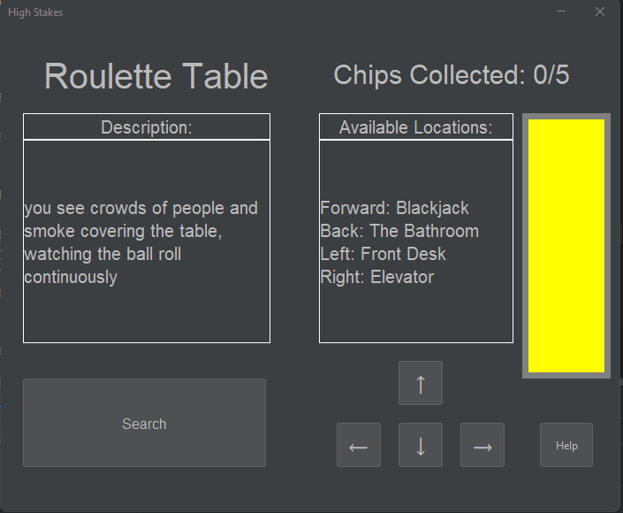

# Results of Testing

The test results show the actual outcome of the testing, following the [Test Plan](test-plan.md)

---

## Player Movement

I will test that the player is able to move in all 4 directions, and buttons
being enabled at the correct time.

### Test Data Used

I will use the valid moves of forward, left, right and back by pressing
the forward, left, right and back buttons.
I will also use the invalid moves of moving in a direction where there is no Location

### Test Result!

Everything works as I expected it to

---

## Player searching Locations for chips and getting help

I will test that the search button is allowing the player to
search for the chips, and that they can pull up the instructions again if needed

### Test Data Used

I will use the valid moves of searching a location with a chip and
without a chip, then I will try to use an invalid move of searching a
location which has already been searched, then I will use the help button.
I will also use the valid move of the player searching with the final move of the game

### Test Result

Everything works as I expected

---

## win/lose test

I will test that the player is able to win and lose the game

### Test Data Used

I will collect all the chips and return to the roulette table to win the game, then I will move around until the timer runs out to lose

### Test Result

Everything works as I expected

---

## game set-up and closing

I will test that the game sets up the correct way, and closes correctly

### Test Data Used

I will run the program, then I will close it before the game reaches a win/loss state

### Test Result

Everything works as I expected

---

## map boundaries

I will test that the player is unable to move off of the map

### Test Data Used

I will move to the edge of the map then i will attempt to make the invalid move of leaving the map

### Test Result

Everything works as I expected

---

## time level test

I will test that the time level will decrease as each move is made

### Test Data Used

I will use valid moves to move around the map and search locations and use the help button

### Test Result

Everything works as I expected

---

## Button Spamming

I will test that spamming any buttons does not cause any problems

### Test Data Used

I will use the valid move of the help button to open the Instructions Pop-up
then I will attempt to spam the help button.
I will spam the valid moves of moving around the map
I will spam the search button

### Test Result

Everything works as I expected

---

## Pop-up test

I will test that when a pop-up is open the player will be unable to interact with the main window

### Test Data Used

I will attempt the invalid move of clicking on the main window while a pop-up is open

### Test Result

Everything works as I expected

---

